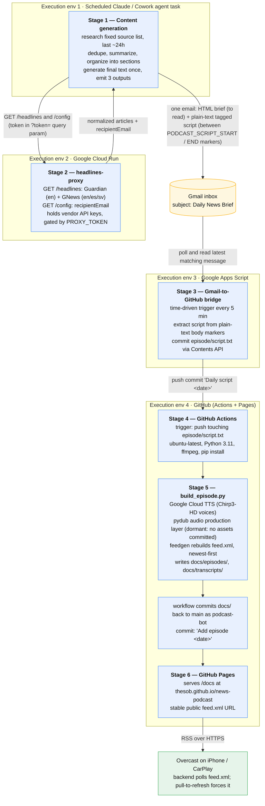

# news-podcast — architecture & daily runtime

A personal, single-user system that produces a **trilingual daily news product**
with zero manual intervention:

- an **HTML email brief** to read, and
- a **music-produced podcast MP3**, published to a real RSS feed and subscribed
  in Overcast on the phone (and CarPlay).

Languages: English, Spanish, Swedish; Norwegian/German content is translated to
English. Each episode also gets an archived plain-text transcript linked from the
feed (Podcasting 2.0 `<podcast:transcript>`).

The repo is **public** (25 tracked files) and holds only one of the pipeline
stages plus config/templates. The daily trigger, the news research, and the
email all happen in systems that are *not* in this repo.

---

## 1. The daily chain — 6 stages across 4 execution environments

Each day leaves **two commits on `main`**: `Daily script <date>` (script in) and
`Add episode <date>` (mp3 + transcript + feed out).

---

## 2. Stage detail

### Stage 1 — Content generation: scheduled agent task
- Prompt: [`prompts/agent-prompt.md`](../prompts/agent-prompt.md), committed as a
  **public template** with `[YOUR PROXY URL]` / `[YOUR PROXY TOKEN]`
  placeholders. Real values exist **only in the live Cowork task**, never in git.
- Cadence lives in the Cowork scheduler (not version-controlled). Researches the
  last ~24 h from a **fixed source list** — do not substitute other outlets:
  - **Spanish:** elpais.com (international + Spain/local), emol.com, latercera.cl
  - **English general:** nytimes.com, washingtonpost.com, heraldtribune.com,
    theguardian.com, BBC News RSS (`feeds.bbci.co.uk`), DW (English), reuters.com,
    apnews.com
  - **English tech/niche:** Hacker News Firebase API (topstories → top 5–8
    items), techcrunch.com, arstechnica.com
  - **Swedish:** dn.se, aftonbladet.se, SVT (svt.se, preferred fallback)
  - **Norwegian:** NRK — translated to English, placed in the English section
  - **Supplement only:** the headlines-proxy (Guardian + GNews)
  - **Forbidden:** NewsAPI.org (free-tier terms); touching GitHub; touching
    Claude Artifacts
- Dedupes overlapping coverage into one entry, writes 2–4 sentence warm
  summaries, and organizes into a fixed structure: optional *sources note* →
  **Top Stories** (3–5) → **Spain & Latin America** → **US & International** →
  **Tech & Niche** → **Sweden** → **Connecting the Dots** → **Hypothesis Watch**.
  - *Connecting the Dots* — always English; interpretation/speculation addressed
    to the user by name, tied to Chile-specific exposure (copper/peso, fuel,
    regional politics), with hedging language and a fixed italic disclaimer.
  - *Hypothesis Watch* — always English; tracks a fixed standing personal
    hypothesis about AI and social cohesion, broken into sub-claims (a)–(d),
    scanned daily rather than re-argued.
- Generates the final text **once**, then emits three outputs from that one text:
  - **A.** posts the brief in the session
  - **B.** sends it as an **HTML email** via the Gmail tool to the address from
    the proxy's `/config` route; subject `Daily News Brief — <date>`
  - **C.** a **plain-text, language-tagged script** embedded in the *same email's
    plain-text MIME part*, between literal lines `<<<PODCAST_SCRIPT_START>>>` /
    `<<<PODCAST_SCRIPT_END>>>`. Every paragraph prefixed on its own line with
    `[EN]` / `[ES]` / `[SV]`; a
    `[SECTION intro|news|connecting_dots|hypothesis_watch]` marker before each
    major section; **URLs stripped** (no value read aloud).

### Stage 2 — headlines-proxy: Google Cloud Run function
[`proxy/index.js`](../proxy/index.js), Node ≥ 20, `functions-framework`, deployed
in region `southamerica-west1`.
- **Purpose:** the agent prompt is public and the agent has no secret storage, so
  the Guardian key, GNews key, and recipient email are held here instead.
- **Routes (token-gated):**
  - `GET /headlines?lang=en|es|sv&topic=&q=&max=` — Guardian for `en` only
    (`content.guardianapis.com/search`, newest-first, `page-size` ≤ 50,
    `show-fields=trailText,bodyText`); GNews for all three
    (`gnews.io/api/v4/top-headlines` or `/search` when `q` is set, `max` ≤ 10 on
    the free plan). Both normalized to
    `{source, title, summary, excerpt, url, publishedAt}`; `excerpt` truncated to
    **800 chars** server-side. Merged via `Promise.allSettled`; partial upstream
    failure still returns what succeeded, total failure → `502`.
  - `GET /config` → `{ "recipientEmail": "..." }`.
- **Auth:** `PROXY_TOKEN` via `Authorization: Bearer` **or** `?token=` query
  param (query form exists because the agent's web-fetch tool can't set headers;
  the token then lands in Cloud Run logs — accepted, since it only authorizes
  "use my news quota"). `crypto.timingSafeEqual` compare.
- **Secrets:** Guardian key, GNews key, `PROXY_TOKEN` via **GCP Secret Manager**
  (`--set-secrets`); `RECIPIENT_EMAIL` is a plain env var (PII, not a
  credential).
- In-memory **per-instance** 15-min cache + 20 req/min rate limiter — best
  effort, not global.
- `--allow-unauthenticated` at the IAM layer; the in-code bearer check is the
  real gate. Deployed with
  `gcloud run deploy --flags-file=deploy-flags.local.yaml`
  ([`proxy/deploy-flags.example.yaml`](../proxy/deploy-flags.example.yaml) is the
  committed template; the `.local.yaml` with real values is gitignored). Free
  tier covers the handful of daily calls.

### Stage 3 — Gmail → GitHub bridge: Google Apps Script
[`scripts/gmail-to-github.gs`](../scripts/gmail-to-github.gs).
- **Time-driven trigger every 5 minutes** (Apps Script has no on-receive event).
- Searches Gmail `subject:"Daily News Brief" newer_than:1d`, takes the latest
  message, extracts the text between the two markers from the **plain-text
  body**. (Previously read a `script.txt` attachment; switched because the Gmail
  tool's attachment encoding silently corrupts non-ASCII — accented ES/SV
  letters, dashes.)
- Commits that text as [`episode/script.txt`](../episode/script.txt) via the
  GitHub Contents API (`PUT`, fetching the current blob SHA first), message
  `Daily script <date>`, using a fine-grained PAT (Contents: Read/Write, this
  repo only) in Script Properties. Config in the script:
  `GITHUB_REPO: 'thesob/news-podcast'`, branch `main`.
- `LAST_PROCESSED_MESSAGE_ID` in Script Properties → commits **exactly once per
  email**; a failed commit is not marked processed and retries next poll.
- **This commit is the pipeline trigger.**

### Stage 4 — Episode build: GitHub Actions
[`.github/workflows/build-podcast.yml`](../.github/workflows/build-podcast.yml).
- **Trigger:** `push` touching `episode/script.txt` (+ manual
  `workflow_dispatch`). `permissions: contents: write`.
- `ubuntu-latest`, Python 3.11, installs `ffmpeg` and
  [`scripts/requirements.txt`](../scripts/requirements.txt)
  (`google-cloud-texttospeech`, `pydub`, `feedgen`, `feedparser`).
- Writes `secrets.GOOGLE_SERVICE_ACCOUNT_JSON` to `/tmp/gcp-key.json`; reads
  `vars.PODCAST_BASE_URL` and `vars.PODCAST_TITLE`.
- Runs `scripts/build_episode.py`, then commits `docs/` back to `main` as
  `podcast-bot` with `Add episode <date>` (`|| echo "Nothing to commit"` guards
  re-runs).

### Stage 5 — `scripts/build_episode.py`: audio + feed builder
[`scripts/build_episode.py`](../scripts/build_episode.py).
- **Parse** (`parse_segments`): splits on `[EN|ES|SV]` tags (tag alone on a line
  or inline), tracks `[SECTION …]` markers, and falls back to **heuristic
  section detection** from normalized spoken headings ("top stories",
  "connecting the dots", "hypothesis watch", plus ES/SV news subheadings) when a
  marker is missing.
- **TTS** (`synthesize_segment`): Google Cloud Text-to-Speech, one call per
  segment. `VOICE_MAP` → Chirp3-HD voices (`en-US-Chirp3-HD-Algenib`,
  `es-US-Chirp3-HD-Gacrux`, `sv-SE-Chirp3-HD-Enceladus`). `MOCK_TTS=1` →
  length-proportional silence, for offline audio-layer testing without spending
  quota.
- **Audio production layer** (`build_audio`, `pydub` → `ffmpeg`). Every asset in
  [`assets/audio/`](../assets/audio/) is **optional** — a missing file just
  disables that layer:
  - opening **jingle**: ~4 s solo, then ducks ~2.5 s into the bed;
  - **per-section looping background bed** (`intro`, `news`, `connecting_dots`,
    `hypothesis_watch`), tiled to the section's spoken length with seam
    crossfades, faded at span boundaries, mixed −22 dB under the voice;
  - **section stinger** at every section change;
  - soft **pling** between consecutive news items (not before subheadings);
  - output normalized to 44.1 kHz / stereo / 128 kbps.
  - **Current state:** no audio assets are committed and CI does not fetch any,
    so builds today produce **voice-only** episodes. The layering code is in
    place and dormant until `assets/audio/*.mp3` files exist at build time. All
    mixing constants (`BED_GAIN_DB`, `INTRO_JINGLE_LEAD_MS`, …) sit at the top of
    the script; the asset contract is in
    [`assets/audio/README.md`](../assets/audio/README.md).
- **Outputs:** `docs/episodes/<date>.mp3`, `docs/transcripts/<date>.txt` (raw
  script; `[SECTION …]` lines stripped, language tags kept).
- **`update_feed`:** rebuilds `docs/feed.xml` with `feedgen`. Adds today's
  `<item>` (enclosure with byte length from `stat().st_size`, `pubDate`,
  `itunes:duration` = `len(audio)/1000`, Podcasting 2.0 `<podcast:transcript>`
  via a small custom feedgen extension), then re-parses the previous feed with
  `feedparser` and re-appends **every prior episode** (unbounded history), sorted
  newest-first. Old transcripts are re-matched by date parsed from the mp3 URL.

### Stage 6 — Hosting & delivery to the phone
- **GitHub Pages** serves `/docs` from `main` → stable feed URL
  `https://thesob.github.io/news-podcast/feed.xml`. `docs/.nojekyll` present. MP3s
  and transcripts are committed into the repo and served by the same Pages site —
  no S3/CDN. Repo must stay public for free Pages.
- **Overcast** subscribes to that URL (Apple Podcasts avoided — unreliable with
  these feeds). Overcast's backend polls on its own schedule; pull-to-refresh
  forces a re-fetch. CarPlay picks the show up from Overcast.
- **Email** is delivered by the Gmail tool in Stage 1 into the normal inbox — it
  is both the human-readable channel and the transport for the script.

---

## 3. Trust & secret boundaries

| Secret | Where it lives | Notes |
|---|---|---|
| Google service-account JSON (TTS) | GitHub Actions **Secret** | write-only once saved; written to `/tmp/gcp-key.json` on the runner |
| Guardian key, GNews key, `PROXY_TOKEN` | **GCP Secret Manager** | mounted to Cloud Run on cold start |
| Recipient email | Cloud Run plain env var | PII, not a credential |
| `PROXY_TOKEN` (also) | live Cowork prompt only | the one secret the agent holds; rotation = new secret version + redeploy + prompt update |
| GitHub fine-grained PAT (Contents R/W) | Apps Script Script Properties | scoped to this repo |
| Built-in Actions `GITHUB_TOKEN` | `permissions: contents: write` | commits `docs/` back |

Public repo, placeholder-only templates. The proxy exists precisely because the
agent prompt is public and the agent has no secret store.

---

## 4. State, idempotency, failure behavior

- **No database anywhere.** Durable state = git history +
  `LAST_PROCESSED_MESSAGE_ID` (Apps Script) + the proxy's per-instance in-memory
  cache.
- **Cross-day story dedup is NOT persisted** — no "seen stories" file, the agent
  has no memory of prior episodes fed back to it; dedup is judgment within a
  single run. (Stories do recur across days as a result.)
- Re-running a date overwrites that day's mp3/transcript; the feed de-dupes the
  item by its URL id.
- **No retry / alerting** if the daily agent silently fails, the email never
  arrives, or Actions fails. The 5-minute Apps Script poll is the only
  self-healing loop, and only for a commit failure — not a missing email.

---

## 5. Design scars worth knowing (they constrain expansion)

- Agent web-fetch tool can't send headers → proxy accepts `?token=` query param.
- Gmail tool attachment encoding corrupts non-ASCII → script travels in the
  plain-text email body between markers, not as an attachment.
- `gcloud` on Windows PowerShell mangles `--set-secrets` → `--flags-file` YAML.
- Local dev machine's Python 3.13 lacks `audioop`/`ffmpeg` → `MOCK_TTS` + WAV
  path for offline testing (`audioop-lts` backport used locally; CI stays on
  3.11).
- Chirp3-HD voices are billed outside the generous Standard free tier.
- Feed + audio history is unbounded by design; repo grows every day.
- The whole "every morning" guarantee lives outside the repo (Cowork scheduler +
  Apps Script poll).

---

## 6. Expansion surface — pointers for the ideas agent

- **Content sourcing / taxonomy:** the source list and every section definition
  live entirely in `prompts/agent-prompt.md`. Structured feed/vendor additions
  belong in `proxy/index.js` (already normalizes multiple upstreams into one
  shape).
- **Personalization:** *Connecting the Dots* and *Hypothesis Watch* are
  prompt-defined; there is no per-user config file or profile.
- **Audio:** tuning constants at the top of `build_episode.py` + drop-in files in
  `assets/audio/`; per-section beds are already a generalized mechanism. Biggest
  quick win: actually ship the assets so builds stop being voice-only.
- **Distribution:** today only one RSS feed + one email recipient. Feed
  generation is centralized in `update_feed()`; adding formats/targets is
  localized.
- **Triggering:** email-as-a-queue via Apps Script polling could be replaced with
  a direct commit, a `repository_dispatch`, or an API call.
- **Observability:** none today — a "did today's episode publish?" health check
  is greenfield.
- **Multi-user / multi-edition:** every stage currently assumes a single user,
  single schedule, single feed.

---

## Authoritative files (pipeline order)

[`prompts/agent-prompt.md`](../prompts/agent-prompt.md) →
[`proxy/index.js`](../proxy/index.js) →
[`scripts/gmail-to-github.gs`](../scripts/gmail-to-github.gs) →
[`.github/workflows/build-podcast.yml`](../.github/workflows/build-podcast.yml) →
[`scripts/build_episode.py`](../scripts/build_episode.py), with
[`README.md`](../README.md) and
[`assets/audio/README.md`](../assets/audio/README.md) as the prose overview.
